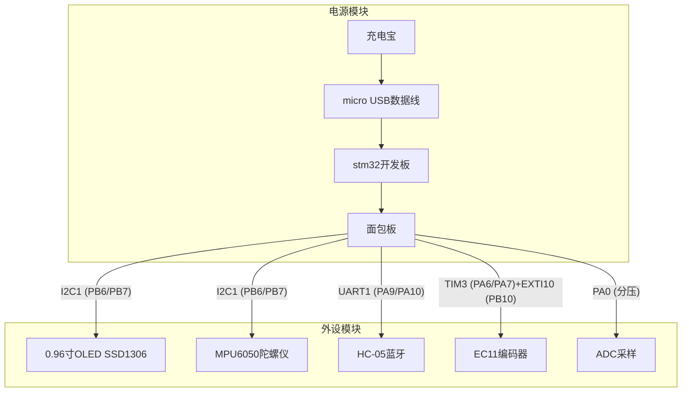
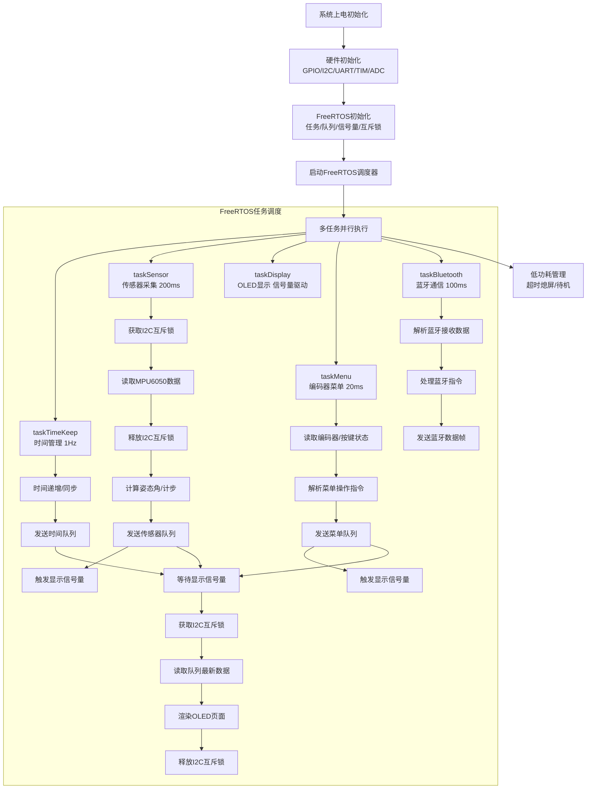
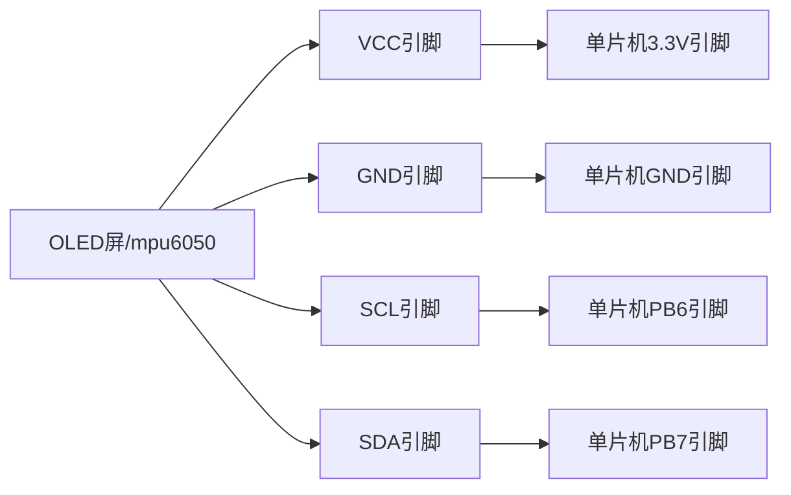
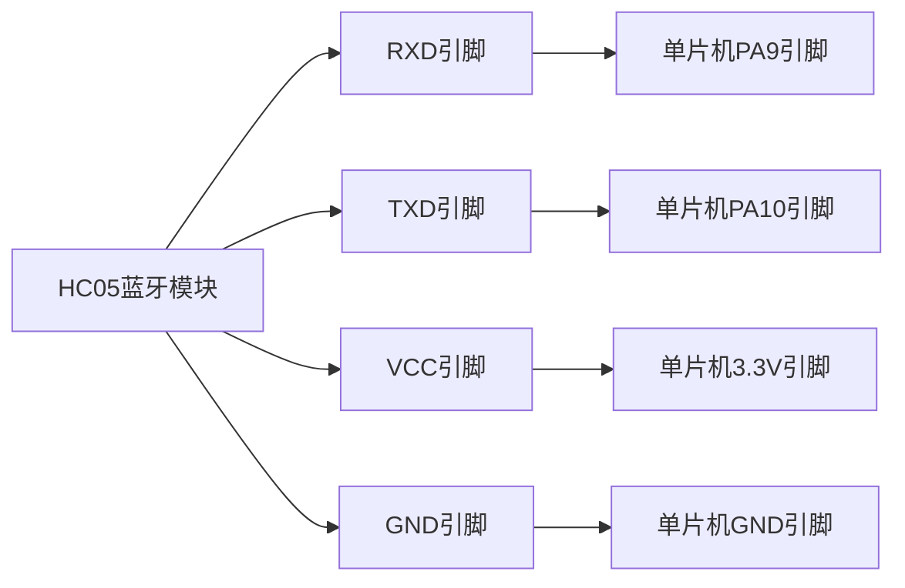
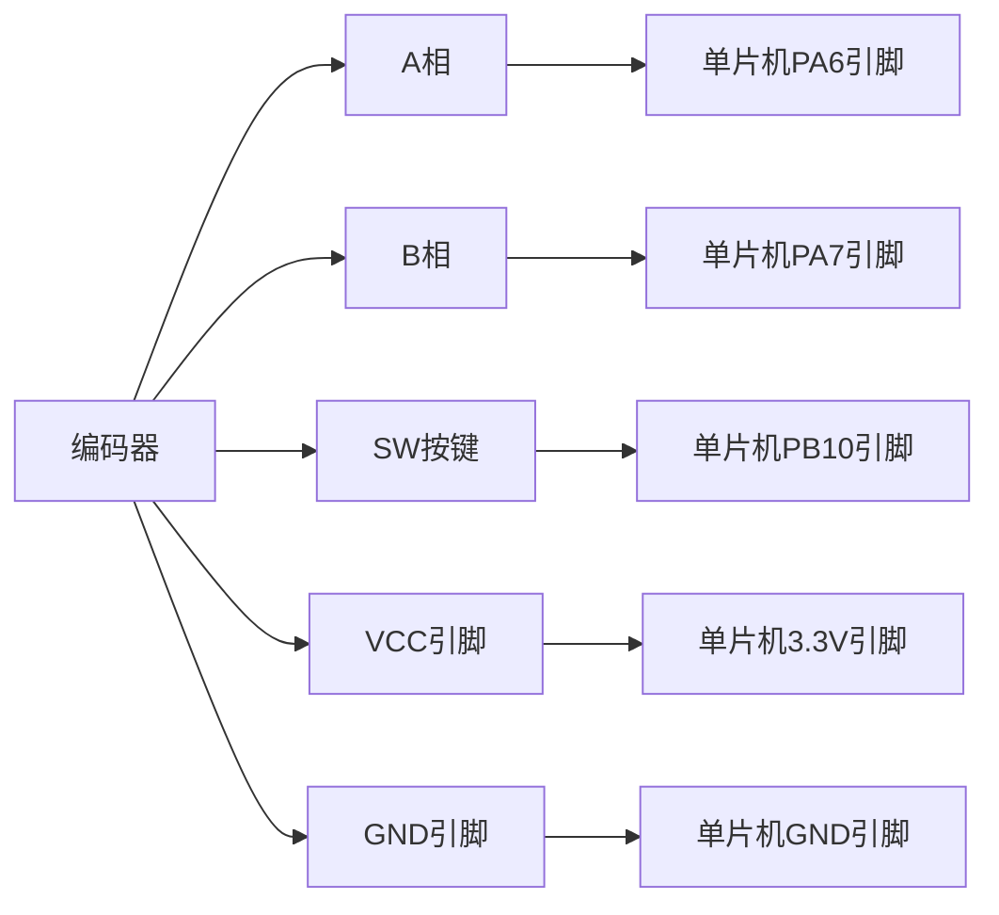

# 1、物料到位情况
### 已到位：
1、STM 32 最小系统板
2、0.96 寸 MK 993 OLED（SSD 1306 控制器，$I^2C$ 接口，4 管脚）
3、ST-Link 调试器
4、MPU 6050（GY-521 模块）
5、HC-05 蓝牙模块
6、EC 11 旋转编码器
7、供电设备(电源线等)
8、杜邦线
9、面包板
10、电阻电容(多规格)
11、AMS 1117-3.3 V
### 未到位：
无

# 2、系统方案设计
### 2.1 系统总体架构

**本智能手表系统采用分层式架构设计，从上至下分为应用层、操作系统层、外设驱动层、硬件层四个核心层级，各层级职责清晰、解耦性强，具体如下：**

- 硬件层：以 STM32F103C8T6 为核心，集成 OLED 显示、MPU 6050 传感器、HC-05 蓝牙、EC 11 编码器、电源管理等硬件模块，通过 $I^2C$、UART、GPIO 等接口完成数据交互；
- 外设驱动层：实现各硬件模块的底层驱动，包括 $I ^2 C$ 总线驱动、SSD 1306 显示驱动、MPU 6050 传感器驱动、UART 蓝牙驱动、编码器驱动等，为上层提供统一的硬件操作接口；
- 操作系统层：基于 FreeRTOS 实现多任务调度，通过队列、信号量、互斥锁等同步机制完成任务间通信，解决裸机程序的阻塞与资源冲突问题；
- 应用层：实现智能手表核心业务功能，包括时间管理、传感器数据采集与解析、蓝牙数据收发、菜单交互、计步算法、电源管理等。

### 2.2 硬件框图

### 2.3 软件流程图

# 3、详细设计文档
### 3.1 硬件部分
##### 1、电源电路

##### 2、$I^2C$ 总线电路

##### 3、蓝牙电路

##### 4、编码器电路

### 3.2 软件部分
##### 3.2.1 模块划分
| 模块名称     | 功能描述                 | 核心文件                                                                   | 对外接口            |
| -------- | -------------------- | ---------------------------------------------------------------------- | --------------- |
| 底层驱动模块   | 硬件外设底层操作             | $stm32f1xx\_hal\_*.c/h、$ $ssd1306.c/h、$ $mpu6050.c/h、$ $bluetooth.c/h$ | 初始化、读写、控制接口     |
| 操作系统适配模块 | FreeRTOS 任务 / 同步机制封装 | $freertos.c/h$                                                         | 任务创建、队列 / 信号量操作 |
| 业务逻辑模块   | 时间管理、计步算法、菜单逻辑       | $task\_*.c/h$                                                          | 数据处理、指令解析接口     |
| 应用交互模块   | OLED 显示渲染、编码器操作、蓝牙通信 | $display.c/h、$ $menu.c/h$                                              | 页面渲染、操作响应接口     |
##### 3.2.2 关键算法描述
1、MPU 6050 姿态角计算（互补滤波）
- 加速度计角度计算：通过重力分量计算静态角度
    $θ_{accel}​=\arctan 2(Ay​,Az​)× \frac{180}{\pi}​$
- 陀螺仪角度计算：通过角速度积分计算动态角度
    $θ_{gyro}​=θ_{gyro_{prev}}​+ω_x​×Δt$
- 互补滤波融合：结合静态精度与动态响应
    $θ=\alpha ×θ_{gyro}​+(1-\alpha)×θ_{accel​}$
    ($\alpha$ 为滤波系数)
2、计步算法（动态阈值峰值检测）
- 合成加速度计算：
    $A_{mag}​= \sqrt{Ax^ 2​+Ay^ 2​+Az^ 2​​}$
- 低通滤波（IIR）：
    $A_{filtered}​=\beta×A_{mag}​+(1-\beta)×A_{filtered_{prev}​}$
- 动态阈值更新：每 50 个采样点更新一次最大值 / 最小值，阈值取中间值
    $threshold= \frac{max(A_{filtered}​)+min(A_{filtered}​)}{2} ​+0.1 g$
- 峰值检测：当滤波后加速度超过阈值且步间隔 > 200ms 时，计步 + 1。
##### 3.2.3 外设配置方案
| 外设       | 配置项             | 参数值       | 配置说明                           |
| -------- | --------------- | --------- | ------------------------------ |
| I2C1     | 工作模式            | Fast Mode | 400kHz 通信速率，适配 OLED/MPU6050    |
|          | 地址模式            | 7 位地址     | 兼容 SSD1306（0x3C）、MPU6050（0x68） |
| USART1   | 波特率             | 115200    | 与 HC-05 蓝牙模块匹配                 |
|          | 数据位 / 校验位 / 停止位 | 8/N/1     | 标准串口配置                         |
|          | 中断              | 使能        | 配合 DMA 接收蓝牙数据                  |
| TIM2     | 预分频器            | 7199      | 72MHz/7200=10kHz 计数频率          |
|          | 自动重装值           | 9999      | 10kHz/10000=1Hz 中断（时间管理）       |
| TIM3     | 工作模式            | 编码器模式     | 检测 EC11 A/B 相脉冲                |
|          | 预分频器            | 0         | 无分频，精准检测旋转步数                   |
| ADC1     | 采样通道            | PA0       | 锂电池电压分压采样                      |
|          | 采样率             | 12 位      | 分辨率满足电压采样精度                    |
| FreeRTOS | 时钟节拍            | 1000Hz    | 1ms Tick，精准任务调度                |
|          | 堆大小             | 15 kb 字节  | 满足 5 个任务 + 同步机制内存需求            |
|          | 互斥锁             | 使能        | 保护 I2C 总线资源                    |
##### 3.2.4 任务调度设计
1、任务优先级与周期

|任务名称|优先级|执行周期|堆栈大小|核心功能|
|---|---|---|---|---|
|taskTimeKeep|High (4)|1000 ms|256|时间递增、同步，发送时间队列|
|taskSensor|AboveNormal (3)|200 ms|512|传感器数据采集、姿态计算、计步、发送传感器队列|
|taskDisplay|Normal (2)|信号量驱动（≈200 ms）|1024|等待显示信号量，渲染 OLED 页面|
|taskMenu|Normal (2)|20 ms|512|读取编码器 / 按键，解析菜单指令，发送菜单队列|
|taskBluetooth|BelowNormal (1)|100 ms|512|蓝牙数据收发、指令解析|

2、同步机制设计

|同步对象|类型|功能|
|---|---|---|
|mutexI 2 C|互斥锁|保护 I 2 C 总线，防止 OLED/MPU 6050 访问冲突|
|semDisplayUpdate|二进制信号量|触发 OLED 显示刷新，避免无效刷屏|
|queueSensorData|队列（24 字节 ×4）|传输 MPU 6050 传感器数据（加速度、角度等）|
|queueTimeUpdate|队列（8 字节 ×2）|传输时间数据（时、分、秒）|
|queueMenuMsg|队列（4 字节 ×4）|传输菜单操作指令（编码器方向、按键事件）|
|queueBtCmd|队列（32 字节 ×4）|传输蓝牙接收的指令帧|

##### （3）任务调度逻辑

- 高优先级任务（taskTimeKeep）每秒执行，更新时间后发送队列，不阻塞其他任务；
- taskSensor 每 200 ms 获取 I 2 C 互斥锁读取传感器数据，释放锁后处理数据，发送队列并触发显示信号量；
- taskMenu 每 20 ms 扫描编码器状态，解析操作后发送队列并触发显示信号量；
- taskDisplay 等待显示信号量，获取后读取所有队列最新数据，获取 I 2 C 互斥锁完成 OLED 渲染；
- taskBluetooth 每 100 ms 处理蓝牙数据，优先级最低，不影响核心功能响应。
# 4、进度汇报
### 4.1 当前完成情况
| 阶段                      | 完成状态    | 验证结果                         | 问题与解决                                 |
| ----------------------- | ------- | ---------------------------- | ------------------------------------- |
| Phase 1（OLED 显示）        | 100% 完成 | 成功显示 "Hello World"，无花屏 / 闪烁  | 初始 I2C 地址错误，修正为 0x 78 后解决             |
| Phase 2（MPU6050 接入）     | 100% 完成 | 可读取加速度 / 角度 / 温度数据，OLED 实时显示 | I2C 总线共享初期接触不良，面包板固定后解决               |
| Phase 3（HC-05 蓝牙）       | 100% 完成 | 蓝牙可配对，手机 APP 接收传感器数据帧        | 蓝牙供电不足，后改用 5 V 接口供电解决                 |
| Phase 4（FreeRTOS + 编码器） | 50% 完成  | 已创建 5 个核心任务，时间 / 传感器任务运行正常   | 部分任务堆栈溢出，增大 totalHeapSize 为 15 kb 后解决 |
| Phase 5（高级功能）           | 0% 未开始  | -                            | 待核心任务稳定后开发                            |
### 4.2 后续工作计划
| 时间节点  | 工作内容              | 交付物             | 验证标准                  |
| ----- | ----------------- | --------------- | --------------------- |
| 1 天   | 完成 Phase 4 剩余开发   | 编码器菜单交互功能       | 旋转编码器切换菜单，短按 / 长按响应正常 |
| 2~3 天 | 调试 FreeRTOS 任务稳定性 | 无死机 / 堆栈溢出的稳定系统 | 连续运行下无异常情况            |
| 4~5 天 | 开发 Phase 5 计步算法   | 计步功能模块          | 走路 / 抬手动作可准确计步，误差尽可能小 |
| 6~7 天 | 开发多级菜单            | 完整菜单系统          | 支持多种菜单操作              |
| 8~9 天 | 系统集成测试与优化         | 完整智能手表原型        | 所有功能正常，响应流畅，功耗符合预期    |